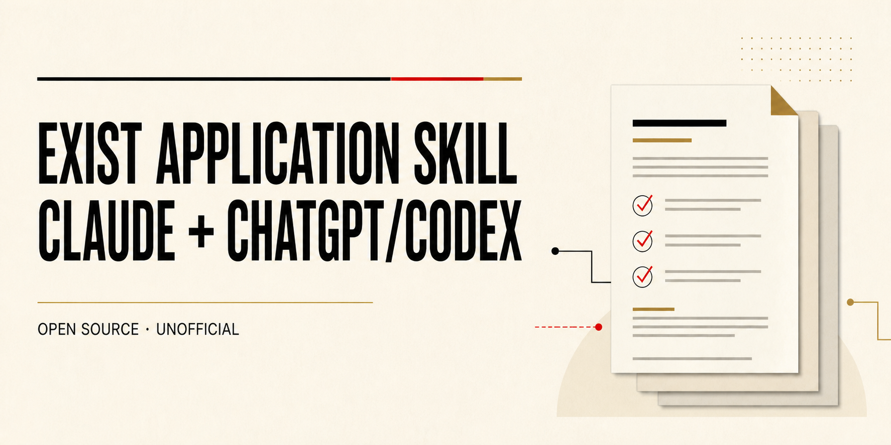

# EXIST-Gründungsstipendium application skill



An evidence-grounded AI skill for screening, planning, drafting, and reviewing applications for Germany's EXIST-Gründungsstipendium (EGS). It is designed for Claude-compatible skills and standalone ChatGPT desktop/Codex skills.

> [!IMPORTANT]
> This is an independent, unofficial community project. It is not affiliated with, sponsored by, approved by, or endorsed by the Federal Ministry for Economic Affairs and Energy (BMWE), the EXIST program, Projektträger Jülich (PtJ), or any university, research institution, or Gründungsnetzwerk. Official documents and the responsible institution always control.

## What it does

The skill helps founders and advisers:

- distinguish EGS from other EXIST programs;
- run a preliminary fit screen before drafting;
- build a claim ledger and evidence register;
- draft the Ideenpapier section by section without inventing evidence;
- review formal readiness, innovation, team, market, finance, sustainability, and consistency;
- prepare unresolved questions and a handoff for the responsible Gründungsnetzwerk.

The university or research institution remains the formal applicant. The skill does not submit, sign, attest, contact third parties, guarantee eligibility, predict approval, or replace program, legal, tax, regulatory, or institutional advice.

## Current-rule refresh

The bundled source map was last baseline-checked on **2026-08-29**. That date is not a promise that every linked rule remains current.

For each real application, the skill requires a fresh check of the official EXIST application page, downloads, current guideline, handbook, Ideenpapier outline, expenditure guidance, and the applicant institution's own process. If current official sources cannot be accessed, results must remain preliminary.

See [the source-verification method](exist-gruendungsstipendium/references/source-verification.md).

## Privacy

Applications can contain unpublished technology, business strategy, customer information, signatures, identity documents, residence data, and other personal information.

- Minimize and redact personal data before sharing it with any AI system.
- Never commit, publish, package, or reuse applicant documents or recognizable applicant details.
- Do not put confidential project details, personal data, or private document text into web-search queries, URLs, analytics, or external tools unless the transfer is necessary, specifically permitted for confidentiality, and legally allowed under the responsible organization's process. Permission alone is not a GDPR lawful basis.
- Use generic official-source searches whenever possible.
- Review the data-use and retention settings of the Claude, ChatGPT, or Codex environment in which the skill runs.
- Do not assume that removing names makes a document anonymous when its context can still identify a person.

This repository contains no server, telemetry, credentials, or applicant database. The released files contain independently written general guidance, official-source links, and synthetic tests—not applicant documents, private source identifiers, or recognizable applicant narratives. That does not override the privacy terms of the model host or tools a user enables. Read [PRIVACY.md](PRIVACY.md) and the packaged [privacy and data-handling guide](exist-gruendungsstipendium/references/privacy-and-data-handling.md) before using sensitive material.

## Install

The ready-to-upload archive is [dist/exist-gruendungsstipendium.zip](dist/exist-gruendungsstipendium.zip). Verify it with [dist/SHA256SUMS.txt](dist/SHA256SUMS.txt) after downloading.

### Claude

- **Claude.ai:** download the ZIP and upload it through the available Skills interface, then enable the skill. Workspace availability depends on the account and administrator settings.
- **Claude Code:** copy the complete `exist-gruendungsstipendium` folder to `~/.claude/skills/exist-gruendungsstipendium/` or to `.claude/skills/exist-gruendungsstipendium/` inside a project.

### ChatGPT desktop and Codex

- **ChatGPT desktop:** import or upload the ZIP through the available Skills interface.
- **Codex personal installation:** copy the folder to `$HOME/.agents/skills/exist-gruendungsstipendium/`.
- **Codex repository installation:** copy it to `.agents/skills/exist-gruendungsstipendium/` in the target repository.

A standalone skill is not the same as a custom GPT. Broad installation through OpenAI's plugin directory across additional ChatGPT and Codex surfaces requires a separate plugin wrapper and its own publication review. This repository currently distributes only the standalone skill.

Detailed and current-sensitive installation notes are in [INSTALL.md](exist-gruendungsstipendium/INSTALL.md).

## Start

Example prompts:

- `Use the EXIST-Gründungsstipendium skill to run a preliminary fit check. Ask only the decisive questions first.`
- `Review this Ideenpapier against the current official criteria. Do not invent missing evidence.`
- `Help me draft section 1.1 from the attached evidence, with visible markers for anything missing.`
- `Map these reviewer comments to evidence, revisions, owners, and consistency checks.`

## Repository layout

```text
exist-gruendungsstipendium/  Skill source and references
dist/                        Uploadable ZIP
scripts/                     Deterministic build and release checks
tests/                       Synthetic behavior-review cases
.github/workflows/           Secret-free validation workflow
```

## Validate a release

PowerShell 7.2 or newer is required for the release scripts:

```powershell
pwsh ./scripts/Test-Release.ps1
```

The check validates the skill structure, packaged privacy safeguards, internal links, synthetic fixture schema, common privacy/secret markers, tracked document formats, ZIP safety, and byte-for-byte source/ZIP parity. Private source denylist values can be supplied locally through `-ForbiddenMarker`; they must never be stored in the repository or CI. Static checks do not prove model behavior, legal compliance, or live external-link availability.

To rebuild the archive deterministically after an intentional source change:

```powershell
pwsh ./scripts/Build-Release.ps1 -Force
pwsh ./scripts/Test-Release.ps1
```

Behavior cases in [tests/behavior-cases.json](tests/behavior-cases.json) are synthetic review prompts. They must be exercised in each intended model host before a release; static checks alone are insufficient for a high-stakes application workflow.

## Version and license

The current public-beta version is recorded in [VERSION](VERSION), with changes in [CHANGELOG.md](CHANGELOG.md).

Released under the [MIT License](LICENSE). Official program names, documents, and marks remain the property of their respective owners; their inclusion as references does not imply endorsement.
